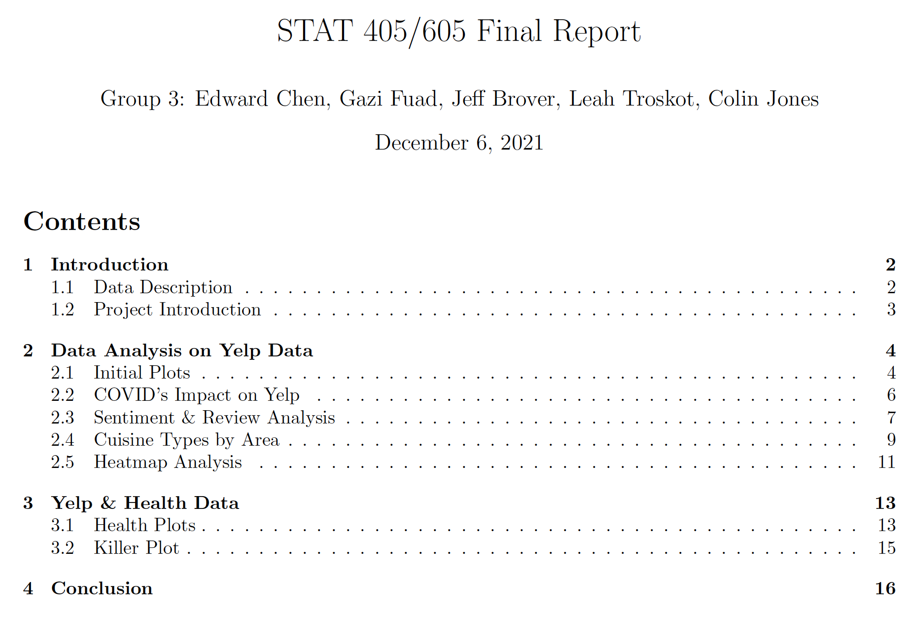
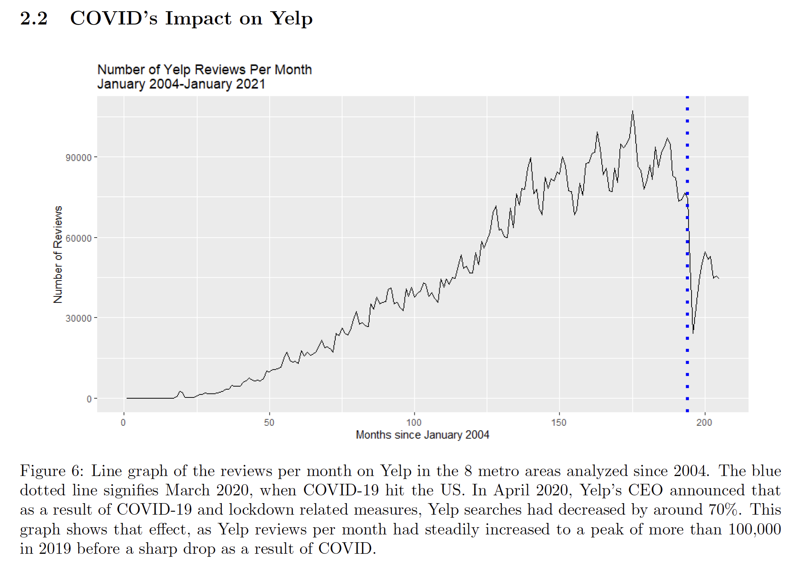
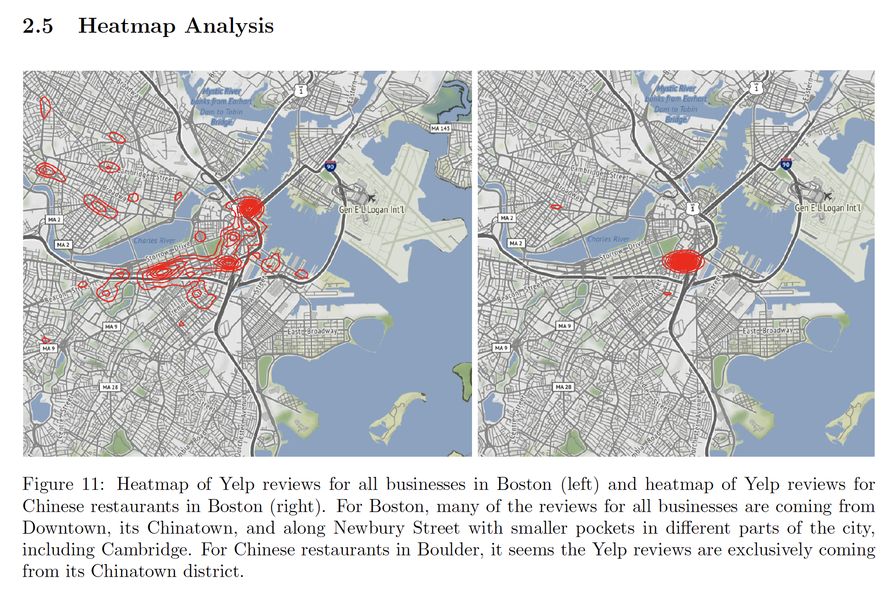

# Yelp Data Analysis

For our final project, my team and I decided to use the [Yelp Open Dataset](https://www.yelp.com/dataset/) that is publicly available to conduct our analysis. The data came in .json format, which we used to convert into .csv and .rda formats to be usable in R. Alongside the Yelp data, we used a secondary dataset from the CDC, detailing [chronic disease and health conditions across the US](https://chronicdata.cdc.gov/500-Cities-Places/PLACES-ZCTA-Data-GIS-Friendly-Format-2020-release/kee5-23sr). We compiled all of our data into a single database from which we made SQL queries in R as needed.

The Yelp data features information from 160,000+ businesses, 8+ million reviews, 1 million tips, and 2+ million users.

The CDC dataset features prevalence of various health conditions such as heart disease, obseity, and more from over 32,400 zip codes in the US.

The datasets were cleaned and reduced to focus on a few metropolitan areas in the US. These areas were Atlanta, Austin, Boston, Boulder, Columbus, Orlando, and Portland. Due to the size of the review datasets (even when separated by city), they could not be uploaded to github.

Our final report can be found [here](https://github.com/gazifuad/Yelp-Data-Analysis/blob/ee92d7fedeefb1a84af824c054b7cc1fcba37376/STAT%20405_605%20Final%20Report.pdf).

 

A huge thanks to my teammates: Edward Chen, Colin Jones, Leah Troskot, and Jeff Brover.
